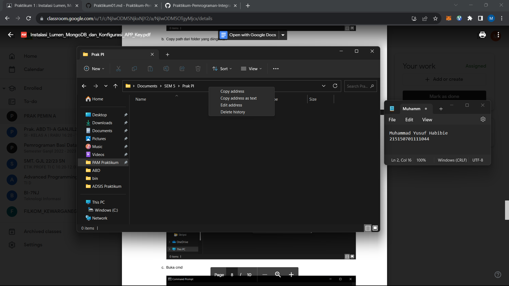

Praktikum 1 : Instalasi Lumen, MongoDB dan Konfigurasi APP Key

Nama : Muhammad Yusuf Habibie

NIM : 215150701111044

Tanggal : 3 September 2023

Asisten : Iqbal Biondy

Instalasi MongoDB

a. Buka halaman https://www.mongodb.com/try/download/community dan klik Download

b. Jalankan mongodb-windows-x86_64-6.0.1-signed.msi

c. Pada welcome screen klik Next

d. Pada bagian End-User License Agreement centang “I accept the terms in the License Agreement” dan klik Next

e. Pada bagian Choose Setup Type klik Complete

f. Pada bagian Service Configuration tanpa mengubah apapun klik Next

g. Pastikan “Install MongoDB Compass” tercentang

h. Pada langkah terakhir klik Install

i. Tunggu hingga tahap instalasi selesai

j. MongoDB Compass akan terbuka secara otomatis

k. Klik Finish untuk menutup dialog instalasi

Instalasi Lumen

a. Buka folder yang diinginkan pada file explorer

b. Copy path dari folder yang diinginkan

c. Buka cmd

d. Buka path pada cmd (cd )

e. Jalankan command untuk menginstall lumen pada folder tersebut (composer create-project --prefer-dist laravel/lumen lumenapi)

f. Buka folder projek lumen kita dan jalankan projek kita (php -S localhost:8000 -t public)

Konfigurasi APP_KEY

a. Buka file web.php pada folder routes, kemudian buat endpoint yang akan mengembalikan random string dengan panjang 32 :

$router->get('/key', function () {

return Str::random(32);

});

b. Melakukan generate dari website https://pinetools.com/random-string-generator

c. Setelah mendapat random string kita akan memasukkan random string tersebut ke file .env kita pada bagian APP_KEY (APP_KEY=<<random_string>>)
