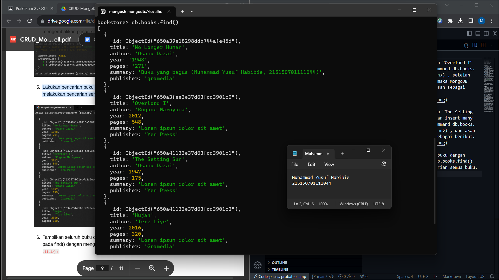

Praktikum 2 : CRUD MongoDB

Nama : Muhammad Yusuf Habibie

NIM : 215150701111044

Tanggal : 12 September 2023

Asisten : Iqbal Biondy

MongoDBCompass

1. Lakukan koneksi ke MongoDB menggunakan connection string

2. Buat database dengan melakukan klik “Create Database”

3. Lakukan insert buku pertama dengan melakukan klik “Add Data”, pilih “Insert Document”, isi dengan data yang diinginkan dan klik “Insert”

4. Lakukan insert buku kedua dengan cara yang sama.

5. Lakukan pencarian buku dengan author “Osamu Dazai” dengan mengisi filter yang diinginkan dan klik “Find”
![Alt text]SS02/image-4.png)

6. Lakukan perubahan summary pada buku “No Longer Human” menjadi “Buku yang bagus (<NAMA>,<NIM>) dengan melakukan klik “Edit Document” (berlambang pensil), mengisi nilai summary yang baru, dan melakukan klik “Update”

7. Lakukan penghapusan pada buku “I Am a Cat” dengan melakukan klik “Remove Document” (berlambang tong sampah) dan melakukan klik “Delete”

MongoDB Shell

1. Lakukan koneksi ke MongoDB Server dengan menjalankan command mongosh bagi yang menggunakan terminal build in OS, Apabila kalian menggunakan MongoDB atlas, silahkan copy connection string dari MongoDB atlas kalian masing-masing dan paste kan di terminal kalian sehingga tampilan terminal kalian akan menjadi seperti berikut

2. Mencoba melihat list database yang ada di server dengan menjalankan command show dbs

Untuk berpindah ke database “bookstore” gunakan command use bookstore , kalian dapat memastikan telah berpindah ke database yang benar dengan melihat tulisan sebelum tanda “>”

Cobalah untuk melihat collection yang ada pada database tersebut dengan menggunakan command show collections

3. Lakukan insert buku “Overlord I” dengan menggunakan command db.books.insertOne(<data kalian>) , setelah insert buku berhasil maka MongoDB akan mengembalikan pesan sebagai berikut.

4. Lakukan insert buku “The Setting Sun” dan “Hujan” dengan insert many dengan menggunakan command db.books.insertMany(<data kalian>) , dan akan mengembalikan pesan sebagai berikut.

5. Lakukan pencarian buku dengan menggunakan command db.books.find() untuk melakukan pencarian semua buku.

6. Tampilkan seluruh buku dengan author “Osamu Dazai” dengan mengisi argument pada find() dengan menggunakan command db.books.find({<filter yang ingin diisi>})

7. Lakukan perubahan summary pada buku “Hujan” menjadi “Buku yang bagus (<NAMA>,<NIM>) dengan mengunakan command db.books.updateOne({<filter>}, {$set: {<data yang akan di update>}}) sehingga output yang dihasilkan oleh MongoDB akan menjadi seperti berikut

8. Lakukan perubahan publisher menjadi “Yen Press” pada semua buku “Osamu Dazai” dengan menggunakan command db.books.updateMany({<filter>}, {$set: {<data yang akan di update>}})

9.Lakukan penghapusan pada buku “Overlord I” dengan menggunakan command db.books.deleteOne({<argument>})

10. Lakukan penghapusan pada semua buku “Osamu Dazai dengan menggunakan command db.books.deleteMany({<argument>})

