Praktikum 4 : Basic Routing & Migration

Nama : Muhammad Yusuf Habibie

NIM : 215150701111044

Tanggal : 26 September 2023

Asisten : Iqbal Biondy

Langkah Percobaan

1. GET : menambahkan endpoint dengan method GET pada aplikasi kita.
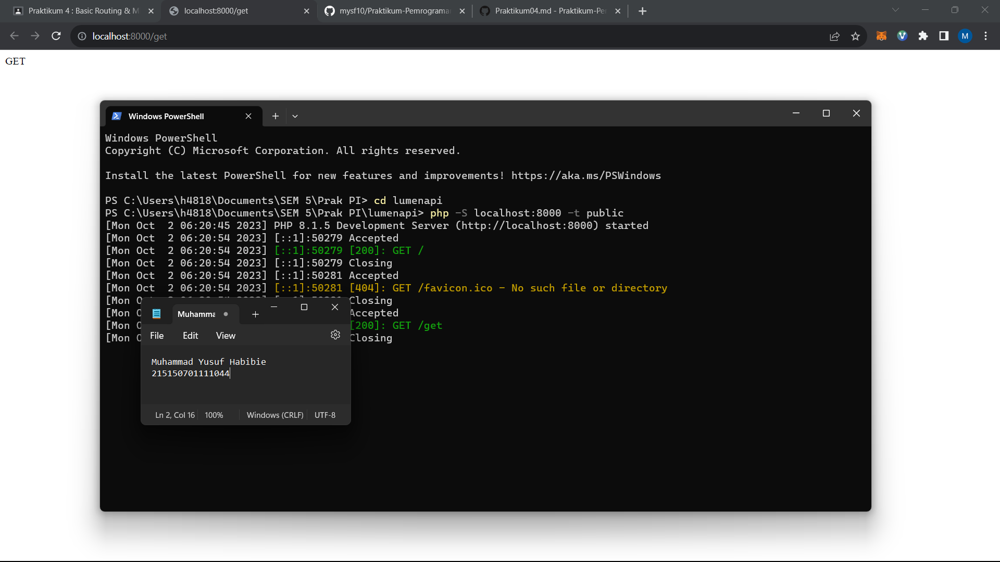

2. POST, PUT, PATCH, DELETE, dan OPTIONS : menambahkan methode POST, PUT, PATCH, DELETE, dan OPTIONS pada file web.php

a. Kita dapat menginstall ekstensi dengan membuka panel extensions lalu mencari thunder client
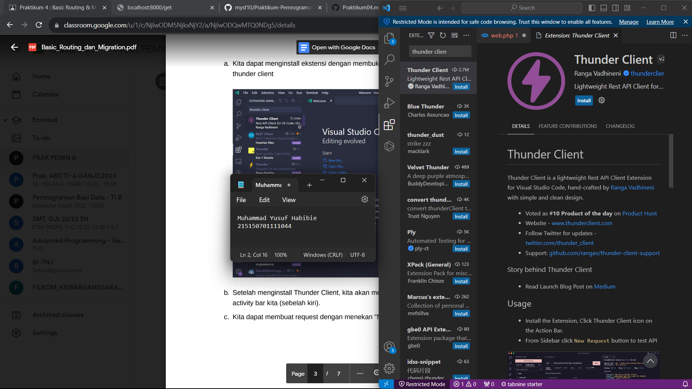

b. Setelah menginstall Thunder Client, kita akan melihat logo seperti petir pada activity bar kita (sebelah kiri).
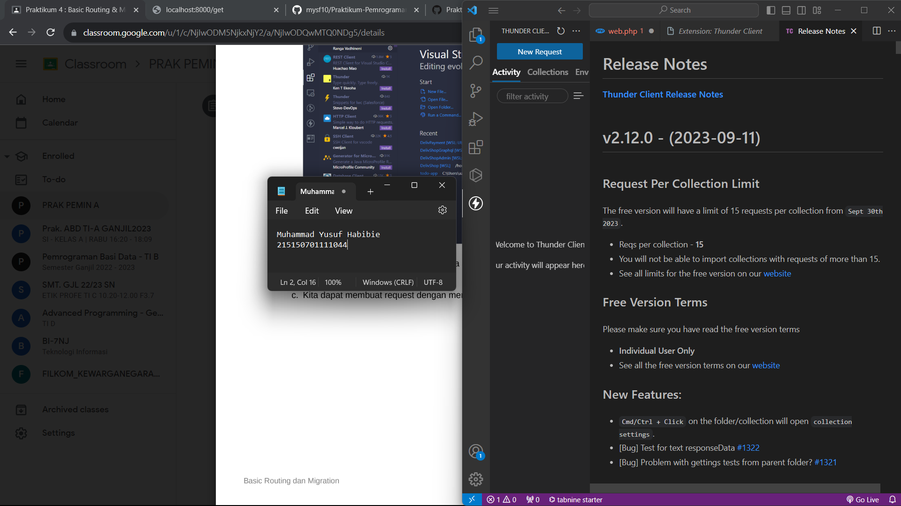

c. Kita dapat membuat request dengan menekan "New Request" pada ekstensi
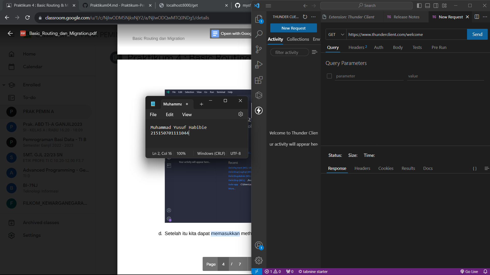

d. Setelah itu kita dapat memasukkan method dan url yang dituju
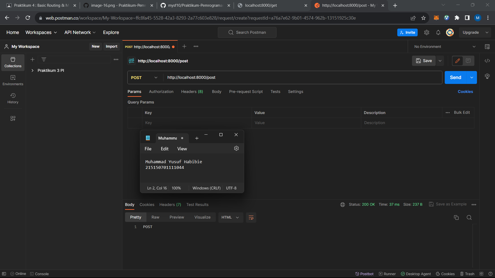

3. Migrasi Database

a. Sebelum melakukan migrasi database pastikan server database aktif kemudian
pastikan sudah membuat database dengan nama lumenapi

b. Kemudian ubah konfigurasi database pada file .env
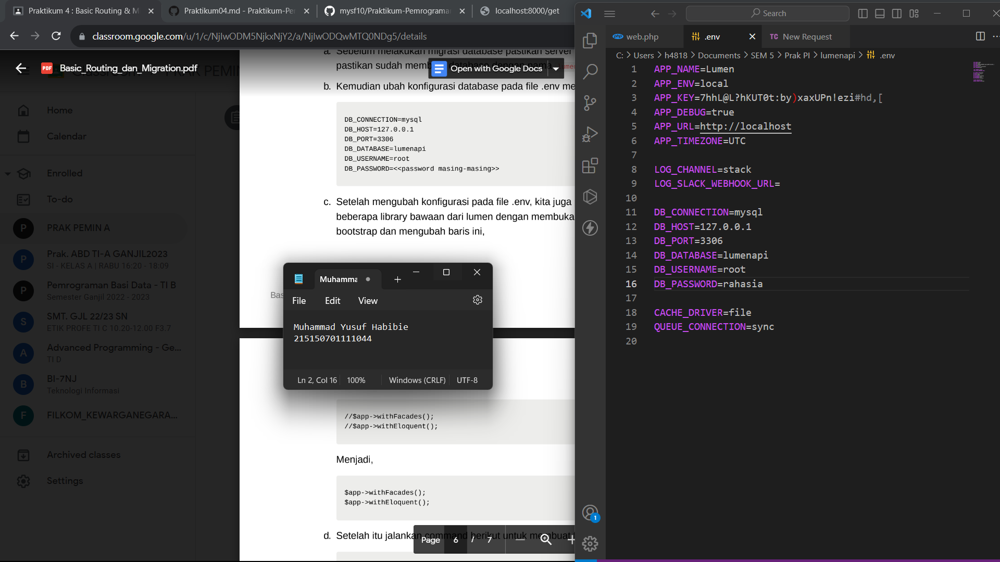

c. Setelah mengubah konfigurasi pada file .env, kita juga perlu menghidupkan
beberapa library bawaan dari lumen dengan membuka file app.php pada folder
bootstrap
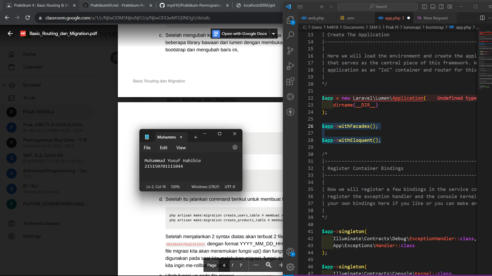

d. Setelah itu jalankan command untuk membuat file migration,
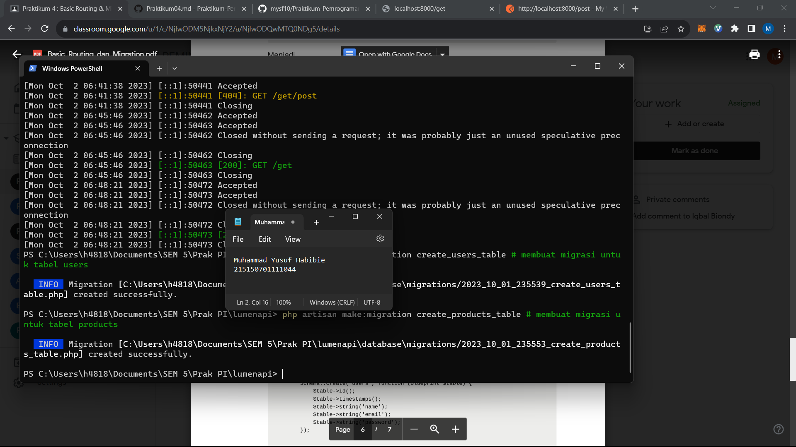

e. Ubah fungsi up pada file migrasi create_users_table
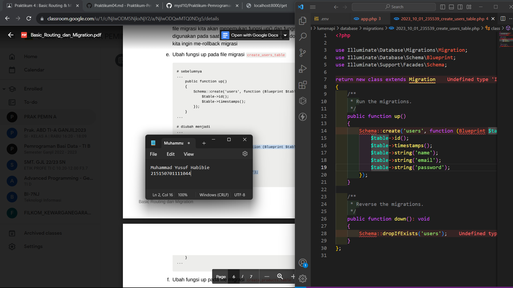

f. Ubah fungsi up pada file migrasi create_products_table
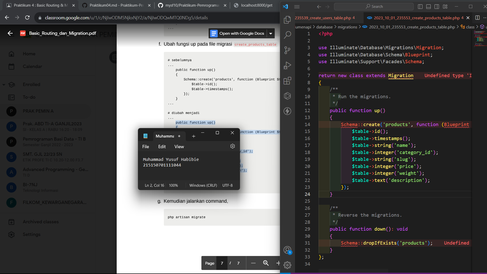

g. php artisan migrate
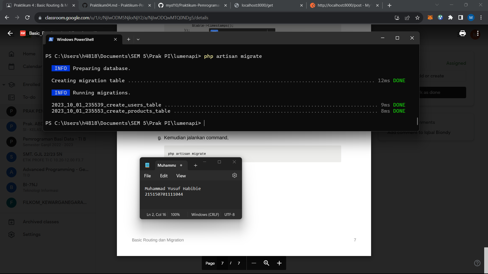