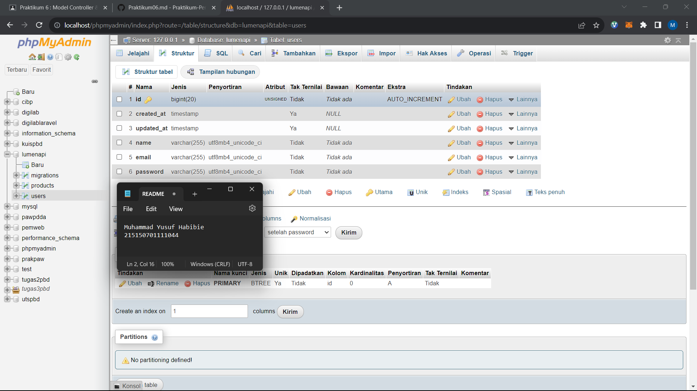
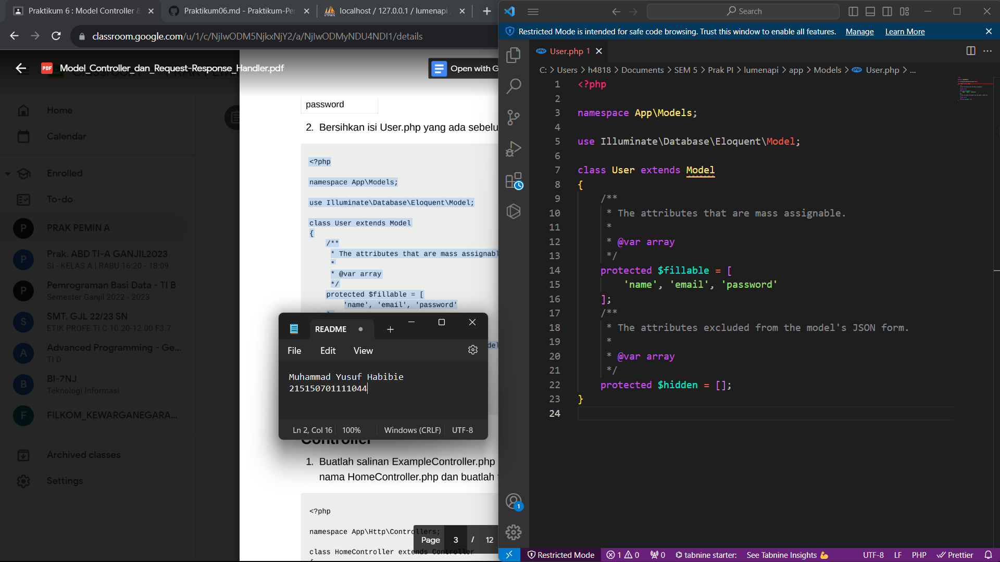
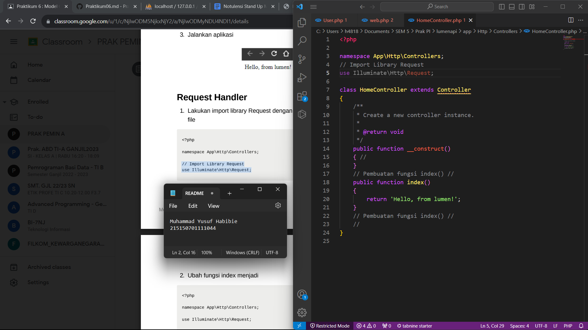
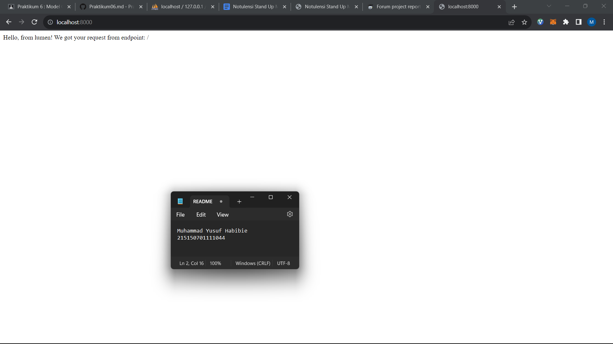

Praktikum 5 : Dynamic Route dan Middleware

Nama : Muhammad Yusuf Habibie

NIM : 215150701111044

Tanggal : 03 Oktober 2023

Asisten : Iqbal Biondy

Langkah Percobaan

1. Dynamic Route
Dynamic route adalah route yang dapat berubah-ubah, contohnya pada saat kita membuka
suatu halaman web, kadang kita melihat /users/1 atau /users/2 , hal ini yang dinamakan
dynamic routes.

2. Aliases Route
Aliases Route digunakan untuk memberi nama pada route yang telah kita buat, hal ini dapat
membantu kita, saat kita ingin memanggil route tersebut pada aplikasi kita.

3. Group Route
Pada lumen, kita juga dapat memberikan grouping pada routes kita agar lebih mudah pada
saat penulisan route pada web.php kita.

4. Middleware
Middleware adalah penengah antara komunikasi aplikasi dan client. Middleware biasanya
digunakan untuk membatasi siapa yang dapat berinteraksi dengan aplikasi kita dan
semacamnya, kita dapat menambahkan middleware dengan menambahkan file pada folder
app/Http/Middleware . Pada folder tersebut terdapat file ExampleMiddleware , kita dapat men-
copy file tersebut untuk membuat middleware baru.

