Praktikum 6 : Model Controller & Request Response

Nama : Muhammad Yusuf Habibie

NIM : 215150701111044

Tanggal : 10 Oktober 2023

Asisten : Iqbal Biondy

Model

1. Pastikan terdapat tabel users yang dibuat menggunakan migration pada bab
sebelumnya.

2. Bersihkan isi User.php yang ada sebelumnya dan isi dengan baris kode berikut

Controller

1. Buatlah salinan ExampleController.php pada folder app/Http/Controllers dengan
nama HomeController.php dan buatlah fungsi index()
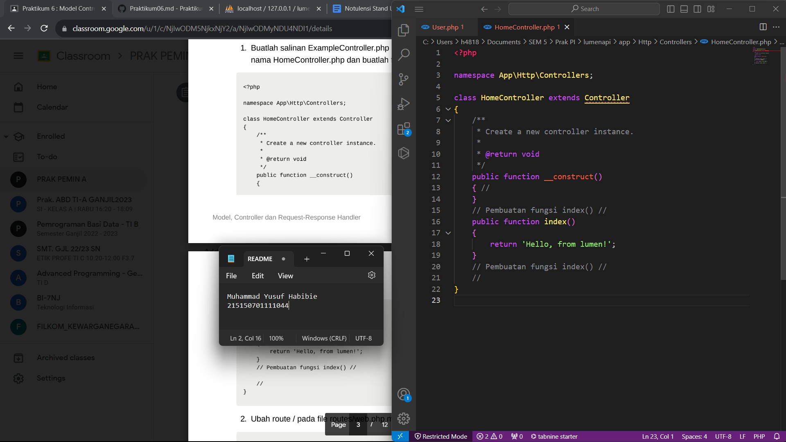

2. Ubah route / pada file routes/web.php menjadi seperti ini
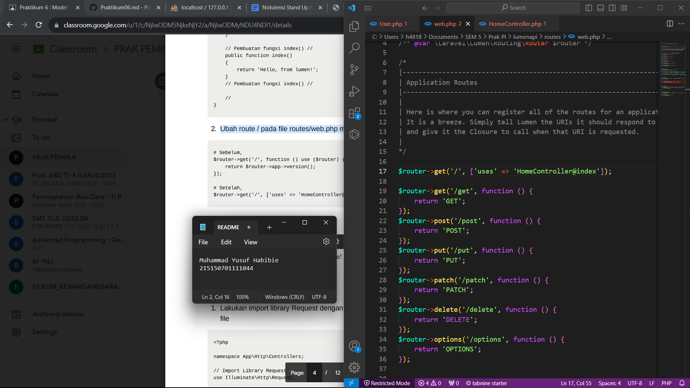

3. Jalankan aplikasi
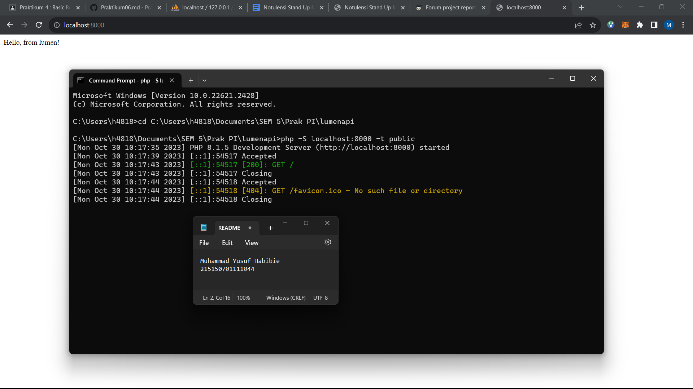

Request Handler

1. Lakukan import library Request dengan menambahkan baris berikut di bagian atas
file

2. Ubah fungsi index menjadi
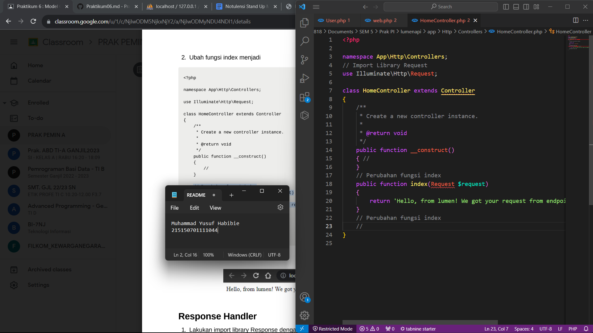

3. Jalankan aplikasi

Response Handler

1. Lakukan import library Response dengan menambahkan baris berikut di bagian
atas file
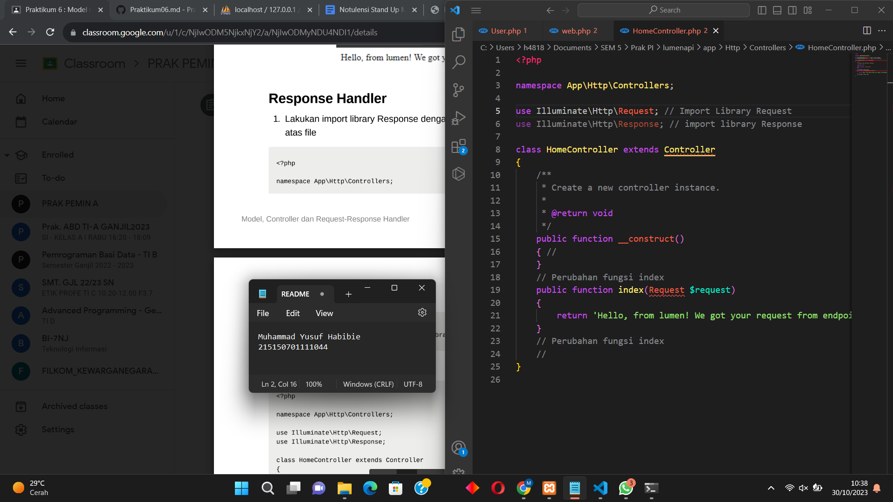

2. Buatlah fungsi hello() yang berisi
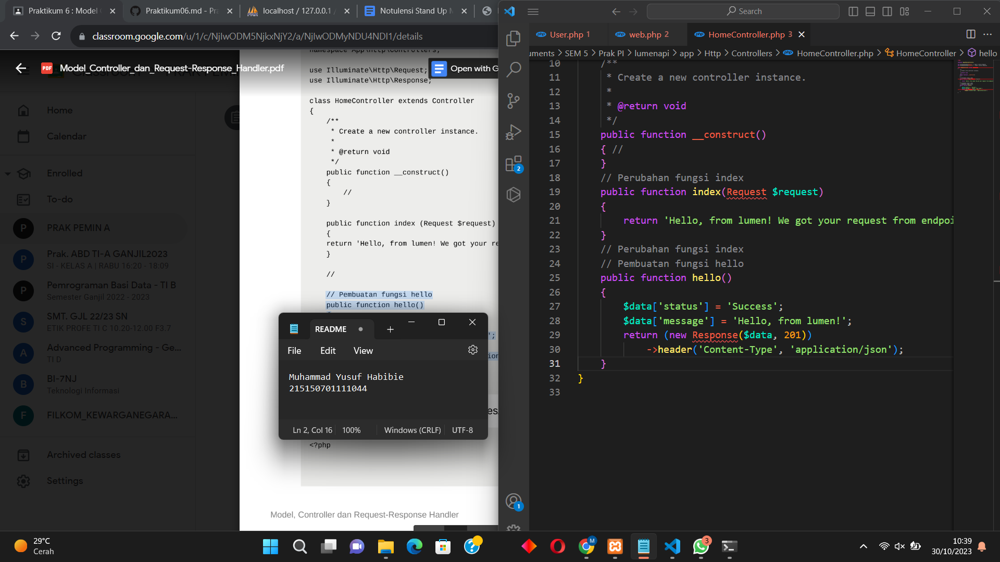

3. Tambahkan route /hello pada file routes/web.php
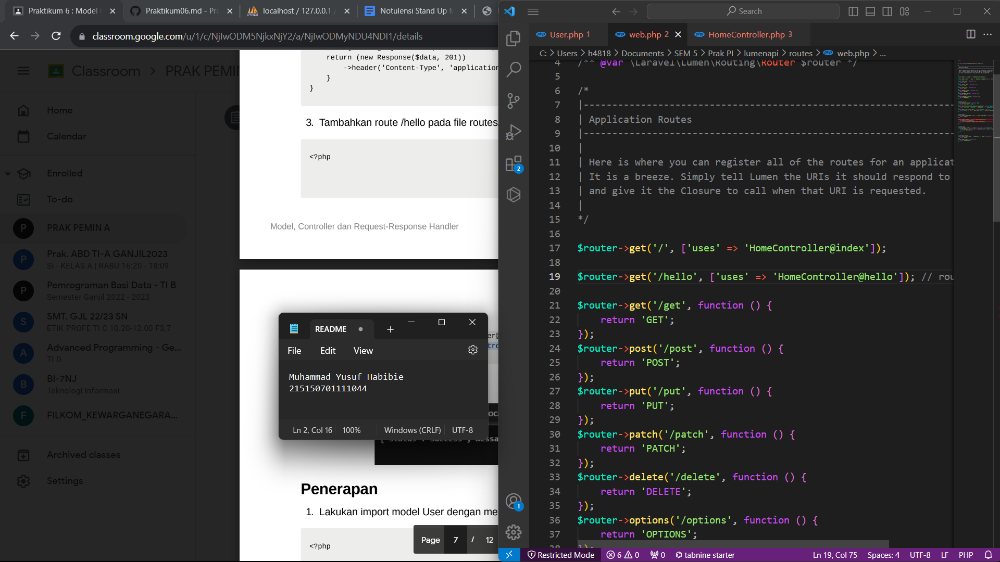

4. Jalankan aplikasi pada route /hello
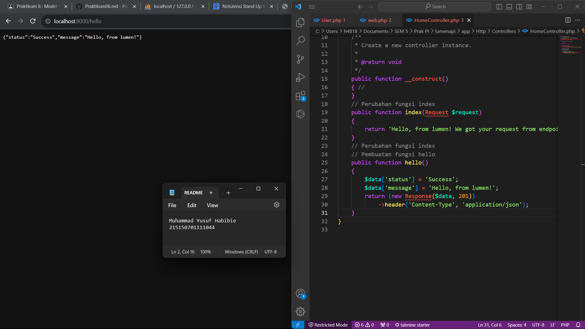

Penerapan

1. Lakukan import model User dengan menambahkan baris berikut di bagian atas file

2. Tambahkan ketiga fungsi berikut di HomeController.php
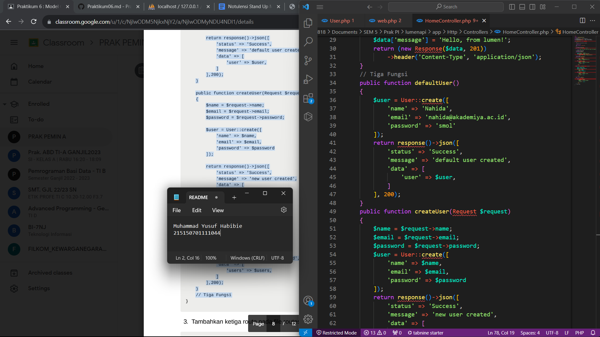

3. Tambahkan ketiga route pada file routes/web.php menggunakan group route

4. Jalankan aplikasi pada route /users/default menggunakan Postman
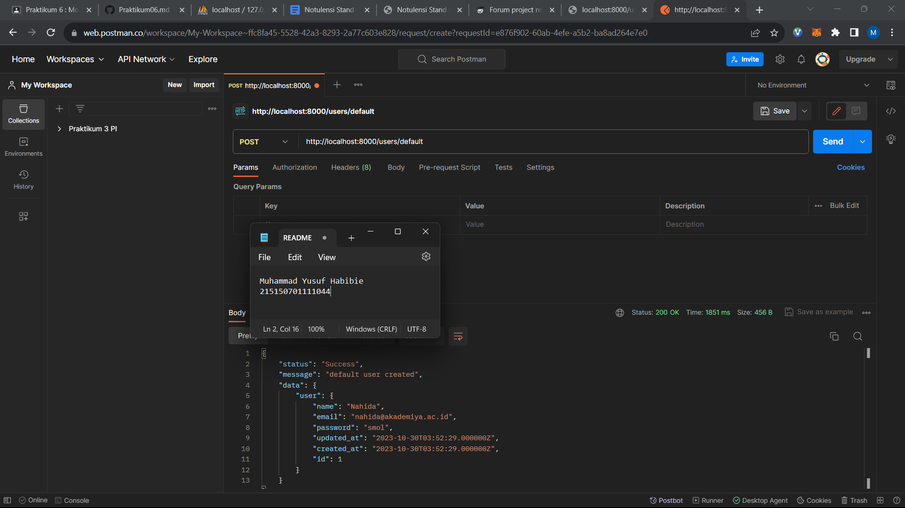

5. Jalankan aplikasi pada route /users/new dengan mengisi body
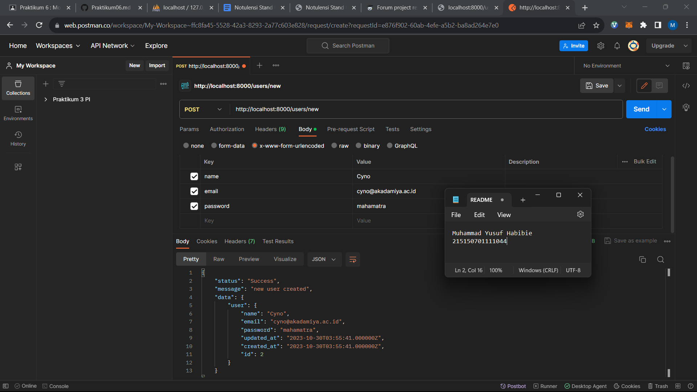

6. Jalankan aplikasi pada route /users/all
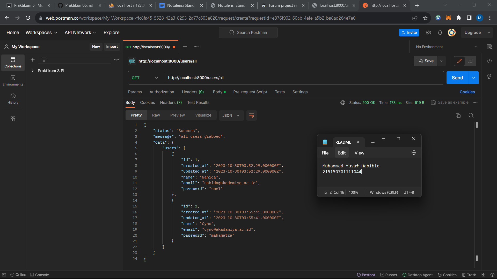