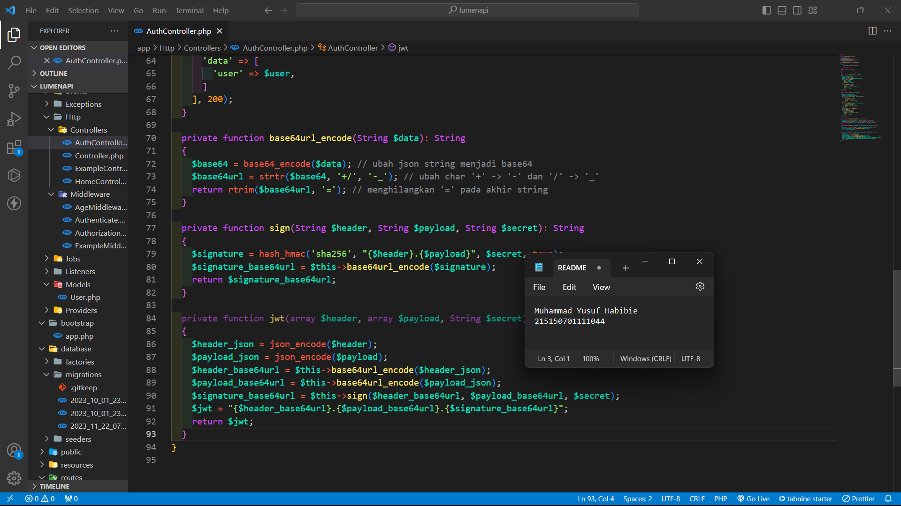
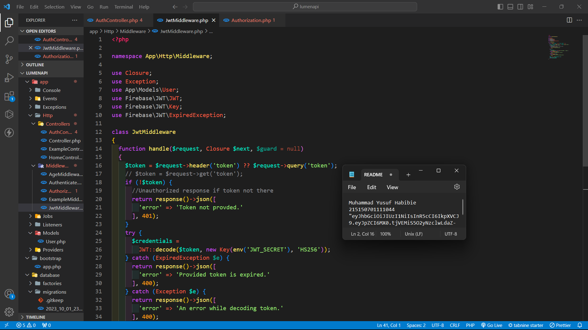

Praktikum 9 : JSON Web Token

Nama : Muhammad Yusuf Habibie

NIM : 215150701111044

Tanggal : 31 Oktober 2023

Asisten : Iqbal Biondy

Penyesuaian Database

1. Lakukan perubahan pada length kolom token dengan menghapus parameter 72 di belakangnya

2. Jalankan perintah di bawah untuk memperbaharui migrasi dan menghapus data yang lama

3. Jalankan aplikasi pada endpoint /auth/register dengan body berikut.

JWT Manual

1. Tambahkan ketiga fungsi berikut pada AuthController.php

2. Lakukan perubahan pada fungsi login

3. Tambahkan keempat fungsi berikut pada Middleware/Authorization.php

4. Lakukan perubahan pada fungsi handle

5. Jalankan aplikasi pada endpoint /auth/login dengan body berikut. Salinlah token yang didapat ke notepad

6. Jalankan aplikasi pada endpoint /home dengan melampirkan nilai token yang didapat setelah login pada header

JWT Library

1. Lakukan generate jwt key secara online menggunakan website Djecrety ― Django Secret Key Generator

2. Lakukan instalasi package jwt firebase dengan menggunakan command berikut

3. Tambahkan fungsi berikut pada file AuthController

4. Lakukan perubahan pada fungsi login menjadi seperti berikut

5. Buatlah file JwtMiddleware.php dan isikan baris code berikut

6. Daftarkan middleware yang telah dibuat pada bootstrap/app.php

7. Tambahkan baris berikut pada file web.php

8. Jalankan aplikasi pada endpoint /auth/login dengan body berikut. Salinlah token yang didapat ke notepad

9. Jalankan aplikasi pada endpoint /home dengan melampirkan nilai token yang didapat setelah login pada header
